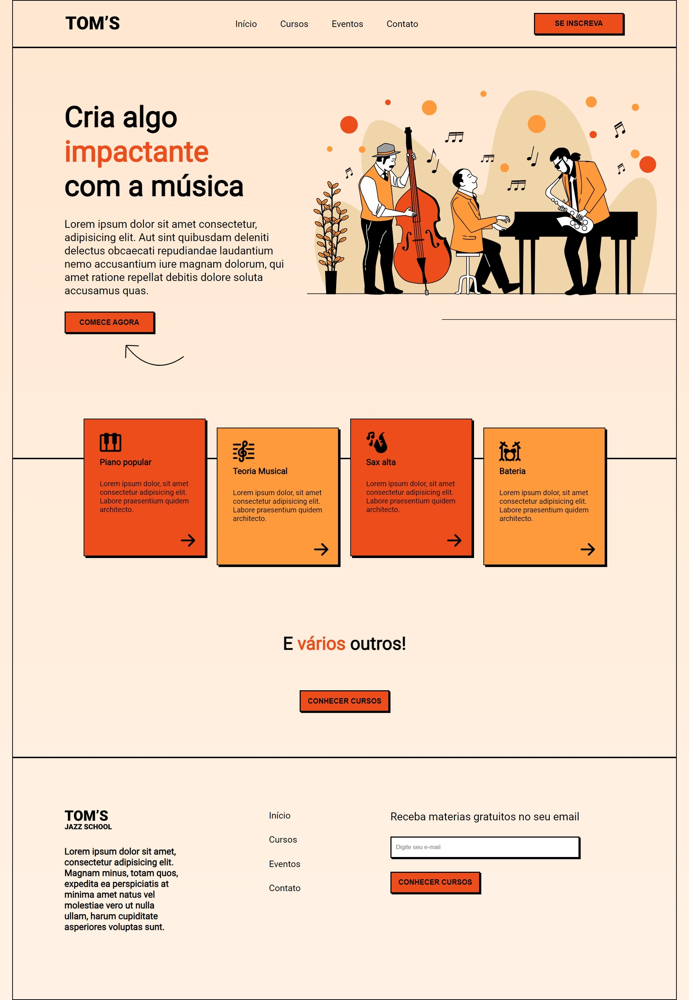

<h1 align="center"> Tom's Jazz </h1>

  <a href="#-tecnologias">Tecnologias</a>&nbsp;&nbsp;&nbsp;|&nbsp;&nbsp;&nbsp;
  <a href="#-projeto">Projeto</a>&nbsp;&nbsp;&nbsp;|&nbsp;&nbsp;&nbsp;
  <a href="#-layout">Layout</a>&nbsp;&nbsp;&nbsp;|&nbsp;&nbsp;&nbsp;

 

  

## 🚀 Tecnologias

Esse projeto foi desenvolvido com as seguintes tecnologias:

- HTML e CSS
- Git e Github
- Figma

## 💻 Projeto

O Tom's Jazz é uma escola de música voltada ao estilo musical JAZZ!

- [Acesse o projeto finalizado, online](https://dougladmo.github.io/Tom-Jazz/)

## 🔖 Layout

Você pode visualizar o layout do projeto através [DESSE LINK](https://www.figma.com/file/76GJ4uK7PyKeAo6dcpVyjA/Tom's-Jazz-School?type=design&node-id=0-1&mode=design&t=EtOjfpFoQ2S4S3l7-0). É necessário ter conta no [Figma](https://figma.com) para acessá-lo.
